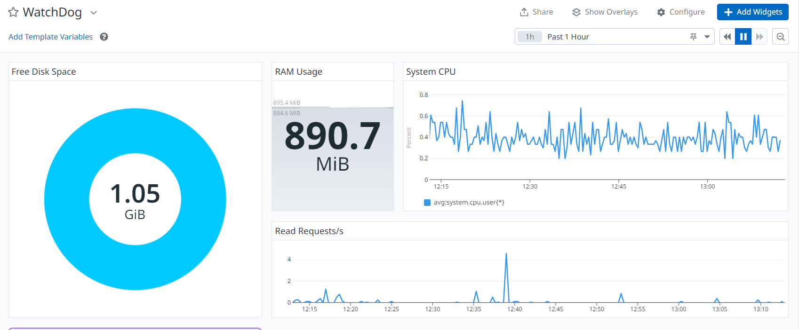

# Monitoring -> DataDog

This Directory contains information such as keys used in configuring [DataDog](https://www.datadoghq.com) monitoring services on one of my servers provided by my course.

## Directory Files:
[./2-setup_datadog](./2-setup_datadog) - contains dashboard id of the dasboard configured below:

